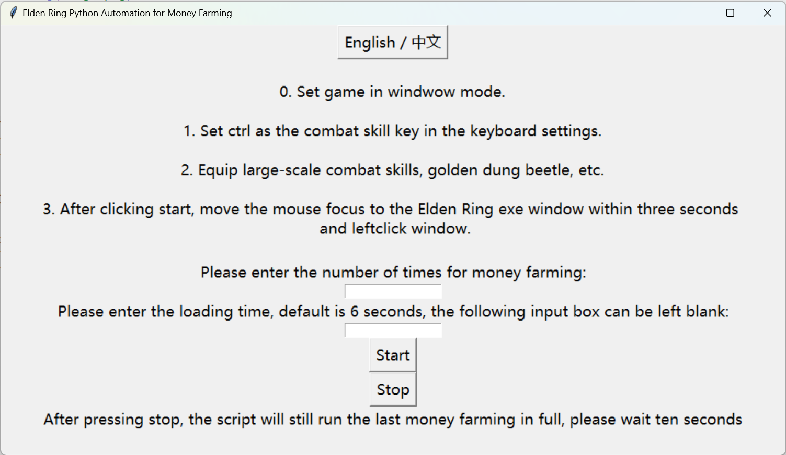

Script base on blibli user AMTur:  
脚本基于 b站 用户 AMTur: 

https://www.bilibili.com/video/BV12x4y1J7LN/?spm_id_from=333.788.video.desc.click&vd_source=d074d0576b6cbd56f8b807d99f34ed18

# 直接下载 Downlaod Directly 
[点击下载脚本程序: Click to download page](./dist/money.exe)


# 自行构建: Build By Yourself

需要 python,pip
以及 tkinter ,pynput,pyinstaller
```
# on windows:
.\.venv\Scripts\Activate.ps1
python ./money.py
pyinstaller --onefile -w .\money.py 
```
# 运行时保持游戏画面在这个状态,Keeping this main windows status.


# Running Example


